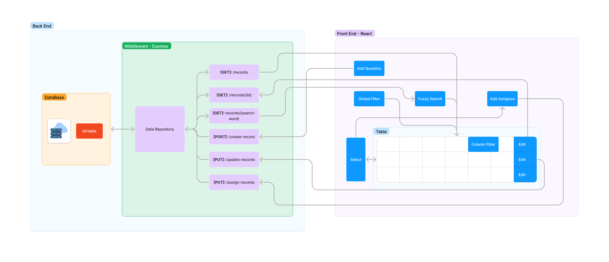
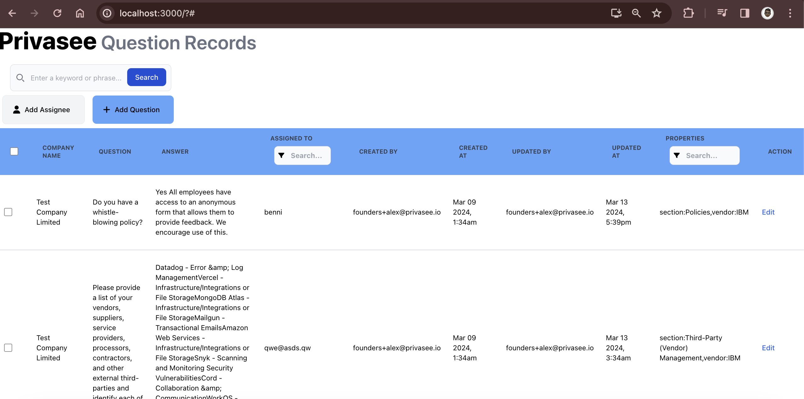

# Question and Answer App
This project aims to develop a user-friendly web application for managing questions and answers. Users can create, edit, assign, and delegate questions and answers efficiently. The system also supports custom properties, history logs, and various filtering options for enhanced usability.

## Overview
- [Database](#database)
  - [Table Structure](#table-structure)
- [Architecture](#architecture)
- [Back End - CRUD Application](#Back-End-CRUD-Application)
- [Tech Stack](#tech-stack)
- [TF-IDF Usage Explanation](#tf-idf-usage-explanation)
- [Code Usage](#code-usage)
  - [Installation](#installation)
  - [Running the Server](#running-the-server)
  - [API Endpoints](#api-endpoints)
- [Front End](#front-end-React-web-Application)
- [Features](#features)


## Database
### Table Structure

| Property        | Type               | Description                                                                                            |
|-----------------|--------------------|--------------------------------------------------------------------------------------------------------|
| _recordId       | int                | The ID of the question, incremental integer                                                           |
| Company Name    | string             | Name of the company. For this exercise we’ll assume there is only one company (of which we’re part of) called “Test Company” |
| _companyId      | int                | The ID of the company, we can use a random set of numbers                                             |
| Question        | string             | Question being asked                                                                                   |
| Answer          | string             | Answer provided by the user                                                                           |
| Created At      | date               | ISO date in which it was created                                                                      |
| Created By      | string (email)     | Email of the user who created the question                                                            |
| Updated At      | date               | ISO date in which it was last updated                                                                 |
| Updated By      | string (email)     | Email of the user who last created the question                                                       |
| Assigned To     | string (email)     | Email of the person to whom the question is assigned. This can be null if never assigned to anyone or if answered on creation. |
| Properties      | list of comma separated key:value | e.g. section:Vendor Information,vendor:IB                                                            |


## Architecture


# Back End CRUD Application
This Express.js application is designed to provide APIs for performing CRUD operations (Create, Read, Update, Delete) on questions and answers. It utilizes a service like Airtable to store the data and implements an API capable of fuzzy searching within the question:answer pairs available.

## Tech Stack
- **Express.js**: A web application framework for Node.js, used to build the server and define API endpoints.
- **Body-parser**: Middleware for parsing incoming request bodies, particularly useful for handling JSON payloads.
- **Cors**: Middleware for enabling Cross-Origin Resource Sharing (CORS), allowing the server to accept requests from different origins.
- **Natural**: A natural language processing library for Node.js, used for TF-IDF (Term Frequency-Inverse Document Frequency) calculations.
- **Airtable**: A cloud service for creating, managing, and sharing databases, used as a storage service for the application's data.

## TF-IDF Usage Explanation
TF-IDF (Term Frequency-Inverse Document Frequency) is employed for its technical advantages such as memory efficiency and computational lightness. It utilizes sparse matrix representations and does not require training data, making it versatile across different domains.

From a non-technical perspective, TF-IDF efficiently analyzes keyword and phrase frequencies. While more complex language models could be considered for future endeavours such as AI-driven question and answer completion, TF-IDF is deemed suitable for the current requirements, allowing flexibility for advanced techniques in the future.


## Code Usage

### API Endpoints
1. Get all records - Retrieve all records stored in the database.
    ```
    GET /records
    ```

2. Get a single record by ID - Retrieve a single record based on the provided ID.
    ```
    GET /records/:id
    ```

3. Get top 5 semantically similar records - Retrieve the top 5 semantically similar records based on the provided search word.
    ```
    GET /records/:search-word
    ```

4. Insert a single record into the database - Create a new record in the database.
    ```
    POST /create-records
    ```

5. Update the desired values of a single record - Update the desired values of a single record identified by its ID.
    ```
    PUT /update-records/:id
    ```

6. Update multiple records - Update multiple records based on the provided data.
    ```
    PUT /update-records
    ```

## UI


# Front End React web application
The front end of this project is built using a modern web framework, React.js, providing a user-friendly interface for managing questions and answers. The user interface allows users to perform various actions such as creating, editing, deleting questions and answers, assigning questions to users, delegating questions, and filtering questions based on assigned users and custom properties.

### Technologies Used
Front End: React.js
Styling: Tailwind CSS 

## Tailwind CSS Usage Explanation
Tailwind CSS is a utility-first CSS framework that facilitates rapid web development by providing a comprehensive set of pre-designed utility classes, allowing developers to efficiently style HTML elements without writing custom CSS. Its modular and responsive approach, coupled with extensive customization options, ensures consistent and performant UI designs across projects while promoting code efficiency and maintainability.

## Features
- *User-Friendly Interface:* Intuitive design for easy navigation and seamless interaction.
- *Question Creation:* Users can create new questions with relevant details.
- *Answer Addition and Editing:* Ability to add and modify answers for existing questions.
- *Question Assignment:* Users can assign questions to specific individuals.
- *Bulk Assignment:* Option to assign multiple questions to a user in bulk, overwriting previous assignments if any.
- *Delegation:* Users can delegate questions to others using their email addresses.
- *Custom Properties/Tags:* Creation of custom key-value pairs linked to questions for better organization.
- *Single User Assignment:* Each question can only be assigned to a single user at a time.
- *History Logs:* Questions maintain a history log showing creation, last update, and the user who made the changes.
- *Filtering Options:* Users can filter questions and answers based on assigned user and custom properties.
- *Fuzzy Search:* Ability to perform fuzzy searches to find relevant questions and answers efficiently.


